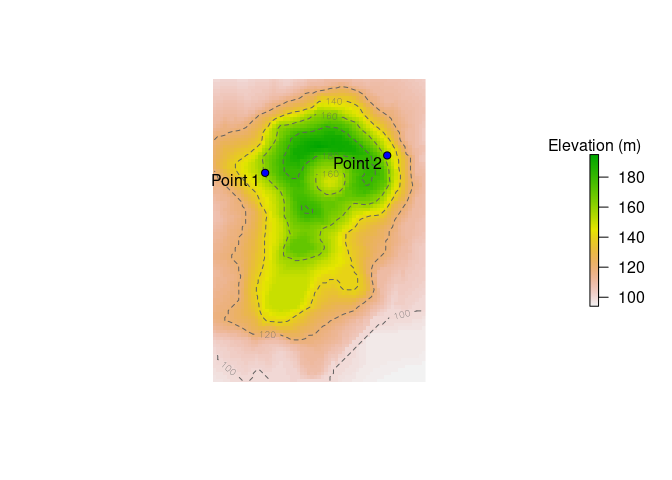
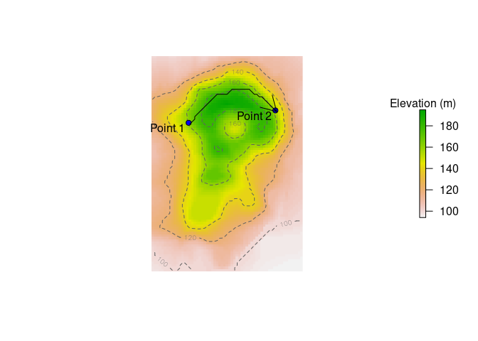

<!-- README.md is generated from README.Rmd. Please edit that file -->

# travelcost

<!-- badges: start -->

[](https://github.com/AustralianAntarcticDivision/travelcost/actions)
<!-- badges: end -->

Estimate the cost of travel on a geographic grid, taking into account
factors such as terrain, slope, or wind or current speeds.

## Installation

``` r
## install.packages("remotes") ## if needed
devtools::install_github("AustralianAntarcticDivision/travelcost")
```

## Example: the cost of walking over hilly terrain

Let’s use the volcano example data as an elevation raster:

``` r
library(travelcost)
library(raster)

dem <- raster(volcano)
projection(dem) <- "+proj=laea +lat_0=-50"
## 10m spatial resolution
extent(dem) <- c(xmin = 0, xmax = ncol(dem) * 10, ymin = 0, ymax = nrow(dem) * 10)

pts <- data.frame(x = c(150, 500), y = c(600, 650), label = c("Point 1", "Point 2"))

plot(dem, legend.args = list(text = "Elevation (m)"), axes = FALSE, box = FALSE)
contour(dem, add = TRUE, lty = 2, levels = c(100, 120, 140, 160, 180), col = "#606060")
points(pts$x, pts$y, col = 1, bg = "blue", pch = 21)
text(pts$x, pts$y, pts$label, adj = c(1.1, 1.1))
```



We wish to find the most energetically-efficient path to follow to get
from point 1 to point 2.

The energetic cost of walking as a function of slope, given by [Minetti
et al. (2002)](https://doi.org/10.1152/japplphysiol.01177.2001) is:

``` r
## i is the slope
cw <- function(i) 280.5 * i^5 - 58.7 * i^4 - 76.8 * i^3 + 51.9 * i^2 + 19.6 * i + 2.5 ## J/kg/m
```

Thus, the cost of walking from one cell to another depends on their
distance apart and the gradient between them:

``` r
edgecost <- function(from, to) {
    ## coordinates are projected, so use Euclidean distance
    dist <- sqrt((from[[1]] - to[[1]])^2 + (from[[2]] - to[[2]])^2)
    start_elev <- extract(dem, from)
    end_elev <- extract(dem, to)
    slope <- (end_elev - start_elev) / dist
    ## keep slope to the range -0.5 to 0.5, for which the cw equation is valid
    slope <- pmax(pmin(slope, 0.5), -0.5)
    ## cost is cw(slope) in J/kg/m, multiplied by distance (m)
    cw(slope) * dist
}
```

Now we can build our travelcost graph and weight the edges according to
the `edgecost` function:

``` r
g <- tc_build_graph(dem)
g <- tc_set_edge_weights(g, fun = edgecost)
```

And finally use it to find the most energetically-efficient path between
our two points:

``` r
p <- tc_shortest_paths(g, from = pts[1, ], to = pts[2, ])[[1]]

plot(dem, legend.args = list(text = "Elevation (m)"), axes = FALSE, box = FALSE)
contour(dem, add = TRUE, lty = 2, levels = c(100, 120, 140, 160, 180), col = "#606060")
points(pts$x, pts$y, col = 1, bg = "blue", pch = 21)
text(pts$x, pts$y, pts$label, adj = c(1.1, 1.1))
## and the optimal path
lines(p[, 1], p[, 2])
plast <- tail(p, 2)
arrows(plast[1, 1], plast[1, 2], plast[2, 1], plast[2, 2])
```



The optimal path roughly follows the contour of the terrain, as you
would expect.
