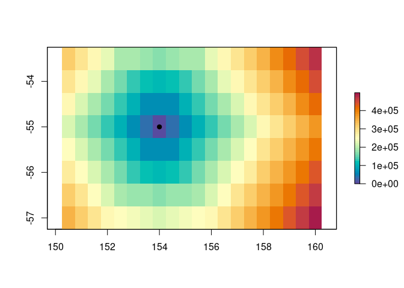

<!-- README.md is generated from README.Rmd. Please edit that file -->

# travelcost

<!-- badges: start -->

[](https://github.com/AustralianAntarcticDivision/travelcost/actions)
<!-- badges: end -->

Estimate the cost of travel on a geographic grid, taking into account
factors such as terrain, slope, or wind or current speeds.

## Installation

``` r
## install.packages("remotes") ## if needed
devtools::install_github("AustralianAntarcticDivision/travelcost")
```

## Example

``` r
library(travelcost)
my_raster <- raster::raster(ext = raster::extent(c(150.25, 160.25, -57.25, -53.25)),
                            res = c(0.5, 0.5), crs = "+proj=longlat")

g <- tc_build_graph(my_raster)

## set edge weights by geographic distance
g <- tc_set_edge_weights(g, fun = geosphere::distHaversine)

## start point to calculate distances from
cx <- c(154, -55)

## calculate travel cost
D <- tc_cost(g, from = cx)

## plot it
library(raster)
plot(D, col = rev(hcl.colors(51, palette = "Spectral")))
points(cx[1], cx[2], col = 1, bg = 1, pch = 21)
```


